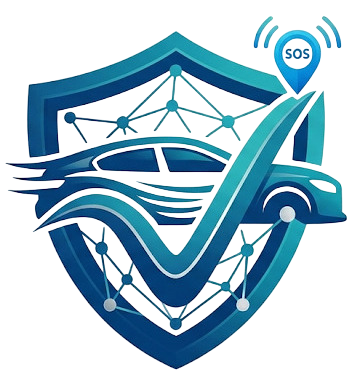

# 🛡️ V-Guard (Vehicle Safety System)

<div align="center">


<br />
  <a href="https://kotlinlang.org/"></a>
  <a href="https://developer.android.com/jetpack/compose"></a>
  <a href="https://firebase.google.com/"></a>
  <a href="https://www.espressif.com/en/products/socs/esp32"></a>
<br />


<h3>Smart Vehicle Monitoring and Automated SOS System.</h3>
<p>A complete IoT and mobile solution bridging real-time vehicle tracking with life-saving crash detection.</p>
</div>

---

## 📖 Why This Project?

Traditional vehicles lack integrated, instant crash notification systems. **V-Guard** solves this by utilizing an ESP32 hardware module paired with a dedicated Android application to provide immediate emergency response.

* **Automated SOS:** In the event of an accident, emergency contacts are instantly notified via SMS with precise Google Maps coordinates.
* **Dual-Layer Redundancy:** Alerts are triggered through the Android app via Firebase, and backed up by a direct GSM module on the hardware to ensure delivery even if the phone is damaged.
* **Live Fleet Tracking:** Monitor the real-time location and connection status of up to 5 vehicles directly from your smartphone.

---

## 📑 Table of Contents

* [🌟 Key Features](#-key-features)
* [🏗️ Technology Stack](#-technology-stack)
* [📂 Deep Project Structure](#-deep-project-structure)
* [⚙️ Prerequisites](#-prerequisites)
* [🚀 Installation & Setup Guide](#-installation--setup-guide)
* [1. Hardware Setup (ESP32)](#1-hardware-setup-esp32)
* [2. Firebase Configuration](#2-firebase-configuration)
* [3. Android App Setup](#3-android-app-setup)


* [📄 License](#-license)

---

## 🌟 Key Features

### 📱 Mobile Application

* **Live Dashboard:** View vehicle status, GPS coordinates, and Wi-Fi signal strength in real-time.
* **Trip History:** Visualize past routes on an interactive Google Map, with waypoints saved every 60 seconds.
* **Multi-Vehicle Management:** Link and manage up to 5 ESP32 modules using their MAC addresses.
* **Emergency Contacts:** Securely store up to 5 emergency phone numbers to be alerted during a crash.

### 📟 Hardware Module

* **Advanced Crash Detection:** Utilizes an MPU6050 accelerometer to detect high G-force impacts and an SW420 sensor for vibration detection.
* **Autonomous Alerts:** Built-in buzzer for local warnings and a SIM800L GSM module for independent SMS dispatch.

---

##  🏗️ Technology Stack

### **Mobile App (Android)**

* **Language & UI:** Kotlin, Jetpack Compose (Material 3).
* **Architecture:** MVVM (Model-View-ViewModel) navigation pattern.
* **Cloud & Auth:** Firebase Authentication (Google & Phone Auth), Firebase Realtime Database.
* **Maps:** Google Maps SDK & Compose Maps.

### **Hardware / Firmware**

* **Microcontroller:** ESP32.
* **Sensors & Modules:** MPU6050 (Accelerometer), SW420 (Vibration), NEO-6M (GPS), SIM800L (GSM).
* **Libraries:** TinyGPS++, Adafruit_MPU6050, Firebase_ESP_Client, NTPClient.

---

## 📂 Project Structure

```bash
V-guard/
├── app/                             # Android Application
│   ├── src/main/java/com/normie69K/v_guard/
│   │   ├── data/                    # Models & Firebase Repositories
│   │   ├── services/                # Background Accident Monitor & SMS Handlers
│   │   ├── ui/
│   │   │   ├── navigation/          # Compose NavHost
│   │   │   ├── screens/             # Auth, Dashboard, Setup, and Settings UI
│   │   │   └── theme/               # Material 3 Colors & Typography
│   │   └── MainActivity.kt          # Entry Point
│   └── build.gradle.kts             # App dependencies & SDK configs
│
└── firmware/                        # ESP32 C++ Application
    └── esp32_code.ino               # Core logic for GPS, GSM, MPU6050 & Firebase Sync

```

---

## ⚙️ Prerequisites

1. **Android Studio**: Required to build and run the mobile application.
2. **Arduino IDE**: Required to flash the firmware to the ESP32.
3. **Hardware Components**:
* ESP32 Development Board
* MPU6050 Accelerometer
* SW-420 Vibration Sensor
* NEO-6M GPS Module
* SIM800L GSM Module
* Active Buzzer

4. **Firebase Project**: A project with **Authentication** (Google & Phone) and **Realtime Database** enabled.

---

## 🚀 Installation & Setup Guide

### 1. Hardware Setup (ESP32)

1. Open `firmware/esp32_code.ino` in the Arduino IDE.
2. Install the required libraries (TinyGPS++, Adafruit_MPU6050, Firebase_ESP_Client, NTPClient).
3. Update the Wi-Fi and Firebase credentials at the top of the file:

```cpp
#define WIFI_SSID "YOUR_WIFI_NAME"
#define WIFI_PASSWORD "YOUR_WIFI_PASSWORD"
#define API_KEY "YOUR_FIREBASE_API_KEY"
#define DATABASE_URL "SECRET_DB_URL"

```

4. Flash the code to your ESP32 board. The Serial Monitor will output the device's MAC Address (Device ID) upon successful boot.

### 2. Firebase Configuration

To connect the app and hardware to your own database, follow these steps:

1. Go to the [Firebase Console](https://console.firebase.google.com/) and create a new project.
2. Navigate to **Authentication** and enable **Email/Password**, **Google Sign-In**, and **Phone Authentication**.
3. Create a **Realtime Database**. Go to the **Rules** tab and set the security rules to allow authenticated users to read and write:
```json
{
  "rules": {
    ".read": "auth != null",
    ".write": "auth != null"
  }
}

```


4. Register a new Android App in your Firebase project settings using the package name `com.normie69K.v_guard`.
5. Download the generated `google-services.json` file.

### 3. Android App Setup

1. Open the project folder in **Android Studio**.
2. Place your `google-services.json` file inside the `app/` directory.
3. Add your Google Maps API Key to the AndroidManifest:

```xml
<meta-data
    android:name="com.google.android.geo.API_KEY"
    android:value="YOUR_MAPS_API_KEY" />

```

4. Build the project and run it on an emulator or physical device.

---

## 📄 License

This project is licensed under the **MIT License** - see the [LICENSE](https://github.com/Normie69K/V-guard?tab=MIT-1-ov-file) file for details.

---

## 🤝 Support & Contributions

* **⭐ Star the Repo:** If you found this project useful, helpful, or learned something from the code, please consider leaving a star! It helps others discover the repository.
* **💡 Feature Requests:** Have an idea for a new feature or found a bug? Feel free to open a new [Issue](https://github.com/Normie69K/V-guard/issues) and let's discuss it!

---

<div align="center">
  <p>Made with ❤️ by <b>Karan Singh</b></p>
  <a href="https://paypal.me/KaranSingh9K" target="_blank">
    <p>Support Me</p>
  </a>
</div>